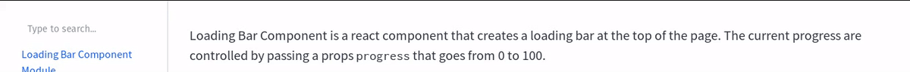

## Loading Bar Component Module

Loading Bar Component is a react component that creates a loading bar at the top of the page.
The current progress are controlled by passing a props `progress` that goes from 0 to 100.

[Read Documentation](https://redwallsolutions.github.io/loading-bar-component-module)
